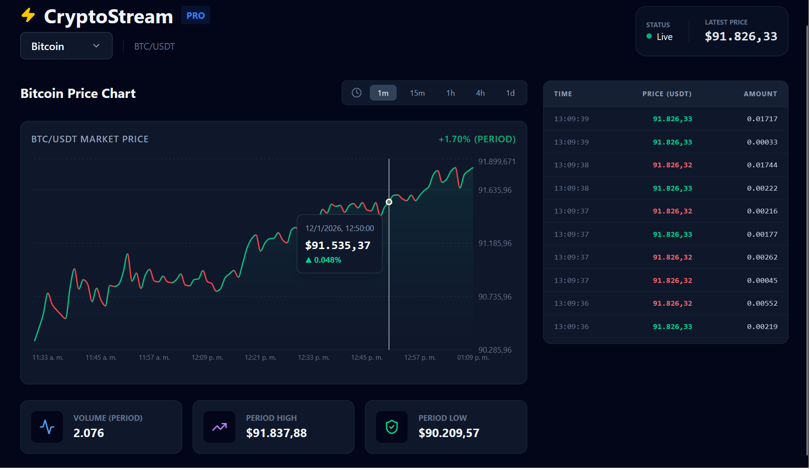

# ⚡ CryptoStream Pro Dashboard

A high-performance real-time financial dashboard built with **React**, **TypeScript**, and **Binance WebSockets**. Designed to handle intensive data streams (50+ events/sec) without sacrificing UI fluidity.

<p align="center">
  
</p>

## 🚀 Key Features

*   **True Real-Time:** Direct connection to Binance WebSockets (`aggTrade` and `kline`) for updates with < 50ms latency.
*   **High Performance:**
    *   **Smart Throttling:** Data buffering using `useRef` to decouple data ingestion from React rendering cycles.
    *   **Virtualization:** Infinite scrolling for trade history using `react-window` (zero lag with thousands of rows).
    *   **Visual Noise Filtering:** Aggressive aggregation logic to merge identical consecutive trades, reducing UI spam.
    *   **Efficient Rendering:** Optimized charts with `recharts` and aggressive memoization (`React.memo`) to minimize repaints.
*   **Hybrid Data Architecture:** Dual system that fetches historical data via REST API (initial hydration) and seamlessly switches to WebSocket streaming.
*   **Multi-Asset Support:** Instant switching between top crypto assets (BTC, ETH, SOL, XRP, etc.) and commodities (PAXG/Gold).
*   **Dynamic Visuals:** Charts feature real-time color changes (Green/Red) based on segment trends and period performance.

## 🛠️ Tech Stack

*   **Frontend:** [React 19](https://react.dev/) + [Vite](https://vitejs.dev/) + [TypeScript](https://www.typescriptlang.org/)
*   **Styling:** [Tailwind CSS v4](https://tailwindcss.com/)
*   **Charting:** [Recharts](https://recharts.org/)
*   **Virtualization:** [react-window](https://github.com/bvaughn/react-window)
*   **Icons:** `lucide-react`

## 📦 Installation & Setup

1.  **Clone the repository:**
    ```bash
    git clone https://github.com/your-username/crypto-dashboard.git
    cd crypto-dashboard
    ```

2.  **Install dependencies:**
    ```bash
    npm install
    ```

3.  **Start development server:**
    ```bash
    npm run dev
    ```

## 🏗️ Data Architecture

The `useBinanceData` hook implements a "Hydration + Stream" pattern:

1.  **Fetch Phase:** Requests the last 100 candles via Binance REST API `/api/v3/klines` to populate the chart immediately.
2.  **Socket Phase:** Subscribes to `wss://stream.binance.com:9443/ws/...` for live updates.
3.  **Merge Logic:** WebSocket updates replace the latest candle in real-time (if timestamps match) or append a new candle when the interval closes.
4.  **Trade Aggregation:** High-frequency trades are buffered and aggregated (by price/side) every 250ms to provide a readable, non-flickering history.

## 📝 License

MIT
